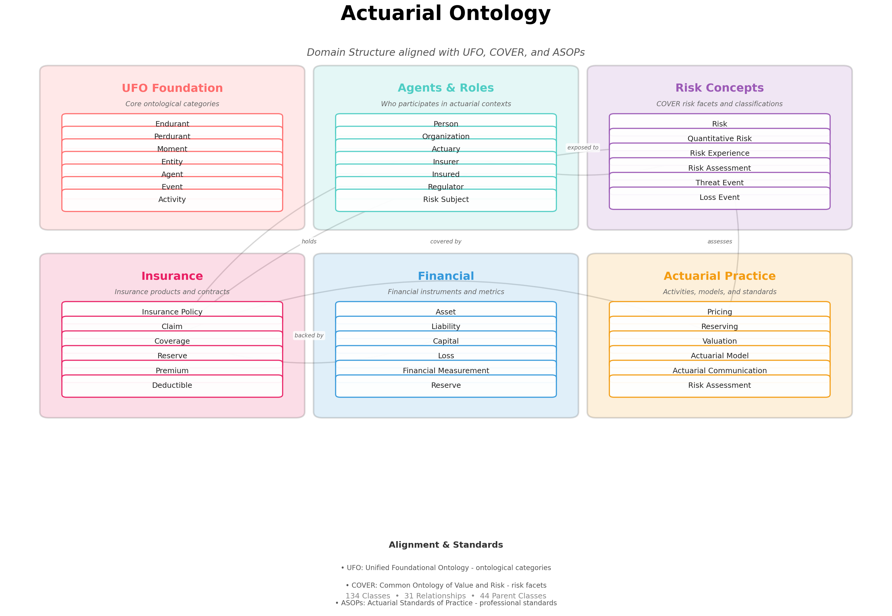

# Actuarial Ontology Visualization Guide

This guide explains the visualization of the Actuarial Ontology domain structure.

## Overview

The Actuarial Ontology visualization provides a clear, legible view of the ontology organized into six domain layers. The visualization is designed to be easily readable and understandable at a glance.



## Domain Structure

The ontology is organized into six complementary domains:

### 1. UFO Foundation 🔴
**Core ontological categories**

Key Concepts:
- **Endurant** - Entities that exist in time with all parts present
- **Perdurant** - Entities that unfold in time (events, activities)
- **Moment** - Dependent properties that inhere in other entities
- **Entity** - Substantial endurants
- **Agent** - Entities with intentionality
- **Event** - Atomic temporal occurrences
- **Activity** - Complex processes over time

This layer provides the foundational ontological distinctions from UFO (Unified Foundational Ontology) that underpin the entire structure.

### 2. Agents & Roles 🔵
**Who participates in actuarial contexts**

Key Concepts:
- **Person** - Human individuals (Kind)
- **Organization** - Structured groups (Kind)
- **Actuary** - Professional measuring/managing risk (Role)
- **Insurer** - Provider of insurance coverage (Role)
- **Insured** - Holder of insurance coverage (Role)
- **Regulator** - Overseer of regulations (Role)
- **Risk Subject** - Entity whose objectives may be undermined (Role)

This layer distinguishes between rigid kinds (Person, Organization) and anti-rigid roles that entities can gain or lose.

### 3. Risk Concepts 💜
**COVER risk facets and classifications**

Key Concepts:
- **Risk** - Abstract concept of potential loss
- **Quantitative Risk** - Risk as a numerical measure
- **Risk Experience** - Risk as an event chain
- **Risk Assessment** - Risk as agent judgment
- **Threat Event** - Event capable of precipitating loss
- **Loss Event** - Event resulting in financial loss

This layer implements COVER's (Common Ontology of Value and Risk) three-faceted view of risk, recognizing that "risk" has multiple distinct meanings.

### 4. Insurance 🎀
**Insurance products and contracts**

Key Concepts:
- **Insurance Policy** - Contract specifying coverage terms
- **Claim** - Request for payment under policy
- **Coverage** - Scope of protection provided
- **Reserve** - Funds set aside for obligations
- **Premium** - Amount paid for coverage
- **Deductible** - Amount insured must pay first

This layer covers the core insurance domain, including products, contracts, and operational concepts.

### 5. Financial 🌊
**Financial instruments and metrics**

Key Concepts:
- **Asset** - Resources with economic value
- **Liability** - Financial obligations owed
- **Capital** - Resources to support operations
- **Loss** - Reduction in value
- **Financial Measurement** - Quantification of financial properties
- **Reserve** - Funds for future obligations

This layer provides the financial foundation supporting insurance and actuarial operations.

### 6. Actuarial Practice ⭐
**Activities, models, and standards**

Key Concepts:
- **Pricing** - Determining premium rates
- **Reserving** - Estimating future obligations
- **Valuation** - Determining economic value
- **Actuarial Model** - Mathematical/statistical models
- **Actuarial Communication** - Reports and opinions (ASOP 41)
- **Risk Assessment** - Identifying and evaluating risks

This layer represents the practice of actuarial science, including key activities, models, and professional standards.

## Relationships Between Domains

The visualization shows key relationships as arrows:

- **Agents → Risk**: "exposed to" - Agents are exposed to risks
- **Agents → Insurance**: "holds" - Agents hold insurance policies
- **Risk → Insurance**: "covered by" - Risks are covered by insurance
- **Insurance → Financial**: "backed by" - Insurance is backed by financial instruments
- **Actuarial → Risk**: "assesses" - Actuaries assess risks
- **Actuarial → Insurance**: "prices" - Actuaries price insurance products

## Design Principles

### Clarity
- Large, readable text (12-18pt for concepts, 32pt for title)
- High contrast between text and backgrounds
- Clean, organized grid layout
- Generous spacing between elements

### Color Coding
Each domain has a distinct color:
- 🔴 Red (#FF6B6B) - UFO Foundation
- 🔵 Teal (#4ECDC4) - Agents & Roles
- 💜 Purple (#9B59B6) - Risk Concepts
- 🎀 Pink (#E91E63) - Insurance
- 🌊 Blue (#3498DB) - Financial
- ⭐ Orange (#F39C12) - Actuarial Practice

### Visual Hierarchy
1. **Title** - Largest text, centered at top
2. **Domain Titles** - Bold, colored by domain
3. **Domain Descriptions** - Italic, explanatory
4. **Concepts** - Clear, bordered bubbles
5. **Relationships** - Subtle arrows connecting domains
6. **Standards Legend** - Bottom section explaining alignment

## Interactive HTML Explorer

The `ontology_interactive.html` file provides an interactive web interface:

### Features
- **Statistics Dashboard** - Count of classes, relationships, and parent classes
- **Domain Cards** - Hover effects and visual feedback
- **Relationship Browser** - Complete listing of object properties
- **Standards Legend** - Information about UFO, COVER, and ASOP alignment
- **Responsive Design** - Adapts to different screen sizes

### Usage
Simply open the HTML file in any modern web browser. No server or special setup required.

## Standards Alignment

### UFO (Unified Foundational Ontology)
The ontology uses UFO's fundamental distinctions:
- **Endurants vs Perdurants** - Things vs happenings
- **Kinds vs Roles vs Phases** - Rigid vs anti-rigid types
- **Moments** - Dependent properties

### COVER (Common Ontology of Value and Risk)
The ontology adopts COVER's analysis of risk:
- **Three risk facets** - Quantitative, Experience, Assessment
- **Event chains** - Threat → Loss → Undermines objectives
- **Value-risk duality** - Risk fundamentally related to value

### ASOPs (Actuarial Standards of Practice)
The ontology incorporates professional standards:
- **ASOP 41** - Actuarial Communications
- **Communication elements** - Reports, Opinions, Disclosures
- **Professional roles** - Appointed Actuary, Intended User

## Generating the Visualization

### Prerequisites
```bash
pip install -r requirements.txt
```

This installs:
- `rdflib` - For parsing the ontology (Turtle format)
- `networkx` - For graph structures
- `matplotlib` - For rendering the visualization

### Run the Script
```bash
python3 visualize_ontology.py
```

### Output Files
1. `ontology_visualization.png` - Main domain structure visualization (390KB, 150 DPI)
2. `ontology_interactive.html` - Interactive web explorer (22KB)

## Understanding the Ontology

### Key Insights

1. **Solid Foundation**: Built on UFO's well-established ontological framework
2. **Role-Heavy Design**: Many concepts are anti-rigid roles (Actuary, Insurer) rather than rigid kinds, reflecting the flexible nature of actuarial relationships
3. **COVER Integration**: Clear separation of risk into three distinct facets avoids confusion
4. **Domain Coverage**: Comprehensive coverage of insurance, finance, and actuarial practice
5. **Standards Compliance**: Explicit representation of ASOP concepts

### Reading the Visualization

1. **Start with UFO Foundation** (top-left) to understand the ontological basis
2. **Follow the arrows** to see how domains connect
3. **Read domain descriptions** for context on each area
4. **Explore concepts** to see the key classes in each domain
5. **Check the legend** at bottom for standards alignment

### Use Cases

The visualization is helpful for:
- **Onboarding** - Introducing new contributors to the ontology structure
- **Presentations** - Explaining the ontology to stakeholders
- **Documentation** - Providing a visual reference in papers or reports
- **Analysis** - Understanding the scope and organization of concepts
- **Teaching** - Illustrating ontological principles and actuarial concepts

## Customization

To customize the visualization, edit `visualize_ontology.py`:

### Change Colors
Modify the `domains` dictionary color values (lines 36-65)

### Add/Remove Concepts
Modify the `concepts` lists in each domain

### Adjust Layout
Modify the positioning parameters (lines 79-94):
- `box_width`, `box_height` - Size of domain boxes
- `x_margin`, `y_margin` - Margins around the figure
- `x_gap`, `y_gap` - Spacing between boxes

### Change Relationships
Modify the `relationships` list (lines 165-173):
```python
(from_domain_idx, to_domain_idx, 'label')
```

### Adjust Text Sizes
Modify `fontsize` parameters throughout the code

## Technical Details

- **Format**: PNG image
- **Resolution**: 150 DPI (suitable for screens and presentations)
- **Dimensions**: 20" × 14" (3000 × 2100 pixels)
- **File Size**: ~390KB (optimized for web)
- **Dependencies**: Python 3.7+, rdflib, networkx, matplotlib

## Future Enhancements

Potential improvements to consider:
- SVG output for infinite scaling
- PDF generation for print quality
- Interactive JavaScript version with zoom/pan
- Filtering by UFO category or domain
- Animation showing concept relationships
- Integration with ontology editors

## Questions or Issues?

For questions about the visualization:
- See `ONTOLOGY-DOCUMENTATION.md` for ontology design details
- See `STANDARDS-REVIEW.md` for alignment with standards
- See `README.md` for project overview

---

**Last Updated**: 2026-01-11
**Version**: 0.2.0-draft
**Generator**: visualize_ontology.py
